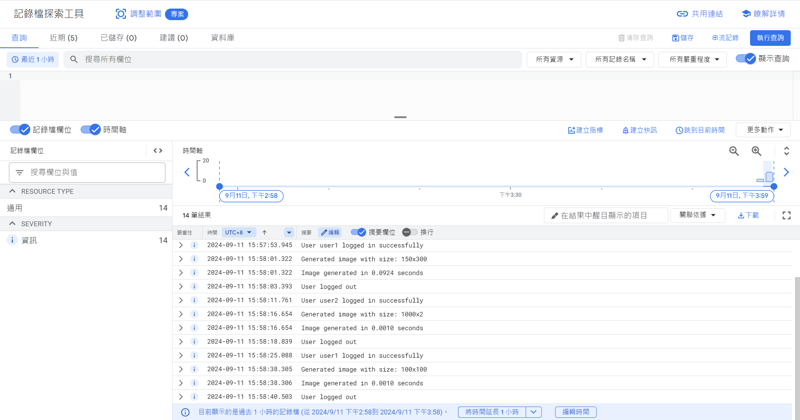

## 問題 1
請用Python 實作實作一個函式，會餵入任意如範例的字串，回傳的值則是一
個數字，表示這個字串四則運算的結果。
例： a = "(2+3) * 2"，要得到10 。

**回答：**  
我使用了3個方式：   
1. **使用`eval()`：**

    缺點：`eval()`會執行傳入的字符串作為 Python 表達式，這會導致執行未經驗證的代碼。假如輸入是來自不信任的來源，可能會導致代碼注入攻擊，允許惡意用戶執行任意代碼。

2. **使用`sympy.sympify()`套件：**

    `sympy.sympify()` 只會解析和執行數學表達式，不會執行任意的 Python 代碼，因此避免了像 `eval()` 這樣的安全隱患。它可以防止惡意代碼注入。

3. 不使用套件與`eval()`的方法。
---

## 問題 2
請用Python-fastapi or flask 實作API Server，完成登入跟登出功能。

**回答：** 
我使用了 flask 實作。
1. Flask 是一個輕量級框架，適合快速建構簡單的應用程式。
2. Flask 提供了許多擴展套件，可以根據需要進行功能擴展。
3. 使用 Flask 預設的 session 機制將資料加密後存放在瀏覽器的 cookie 中。

缺點：   
Flask 並沒有針對高效能進行優化，相比於 FastAPI 來說，對於處理大量併發請求的效能較差。

---

## 問題 3
延續上題請寫另一支API 需通過上題API Server 驗證，並根據輸入的寬高數值，給予對應大小的png ，圖片顏色不限，可使用各種pip 套件。回傳時間需小於0.7 秒。

**回答：** 

`session`檢查使用者是否已登入。      
`Pillow`生成指定大小的圖片。   
`io.BytesIO` `send_file`將生成的圖片以二進位流的方式回傳給客戶端。   
`logger`日誌記錄圖片生成時間。

---

## 問題 4
申請Google Cloud 免費額度，使用Google Cloud Logging 紀錄第二題的API使用狀況上傳。

**回答：** 
申請免費額度，並使用 GCP 紀錄登入、登出狀態、圖片生成的大小、回傳時間。

---

## 問題 5
呈上，請實作unit testing/e2e testing。

**回答：**    
1. 使用`Selenium` 實作e2e test。
2. 使用`unittest` 實作unit test。

---

## 問題 6
RDB/NoSQL DB各有什麼優缺點？

**回答：** 

### RDB（關聯式資料庫）
#### 優點：
1. 結構化資料：RDB 使用表格來儲存資料，資料有固定的結構（Schema），適合儲存高度結構化的資料。
2. ACID 性質：支援原子性、一致性、隔離性、持久性（ACID）事務，保證資料一致性和可靠性，適合金融、銀行等需要高可靠性的應用。
3. 強大的查詢語言：SQL 是一個強大且通用的查詢語言，支持複雜的查詢、合併、多表查詢等操作。
4. 資料完整性：有外鍵、約束等機制來保證資料的完整性和正確性。
#### 缺點：
1. 擴展性差：RDB 在水平擴展（scale-out）上比較困難，通常依賴於垂直擴展（scale-up），即通過升級單一伺服器的硬體來應對需求增加。
2. 靈活性低：資料結構一旦定義後很難修改，如果需要頻繁修改資料結構，會導致開發過程變得複雜。
3. 大數據處理效率低：當面對大規模的資料和高頻次的讀寫操作時，RDB 的效能可能不如 NoSQL 資料庫。
### NoSQL 資料庫
#### 優點：
1. 高擴展性：NoSQL 資料庫通常設計為分散式的，天然支持水平擴展，適合處理大規模資料和高流量的應用場景。
2. 靈活的資料結構：NoSQL 無需預先定義 Schema，允許動態修改資料結構，適合儲存非結構化或半結構化資料。
3. 高效能讀寫：適合處理大數據和高頻讀寫操作，尤其在需要快速存取的情況下，如即時應用和物聯網。
4. 多樣化儲存模式：提供多種資料模型（文件型、鍵值型、圖形型、列儲存型），可以根據具體需求選擇合適的儲存方式。
#### 缺點：
1. 不支持 ACID 事務：大多數 NoSQL 資料庫僅支持最終一致性（Eventual Consistency），不如 RDB 能提供強一致性，這對一些高一致性要求的應用來說是劣勢。
2. 缺乏標準化的查詢語言：不像 SQL 那樣統一標準，不同 NoSQL 資料庫有各自的查詢語言，學習成本較高。
3. 資料完整性控制不足：NoSQL 資料庫通常缺乏像 RDB 那樣強大的外鍵和約束機制，可能需要在應用層面自行實現資料的完整性檢查。

### 適用場景：
1. RDB 適合資料結構清晰、對資料一致性要求高的應用，如銀行系統、ERP 系統。
2. NoSQL 則適合需要高擴展性、大數據量處理的應用，如社交媒體、即時消息系統、物聯網應用等。

---

## 問題 7
根據 https://roadmap.sh/backend ，盤點你既有哪些技能。

**回答：**   
1. Programming Languages and Frameworks:   
    JavaScript, Node.js

2. Version Control:   
    Git, GitHub, GitHub Actions

3. Databases and Caching:   
    MySQL, MongoDB, Redis

4. Security and Authentication:   
    JWT, OAuth

5. Web and API Technologies:   
    RESTful API, Socket.io, Caddy

6. Database Concepts:   
    ACID, Transactions

7. Cloud services :    
EC2, Load Balancer, ElastiCache, Atlas MongoDB, CloudFront, S3, RDS, Route 53

